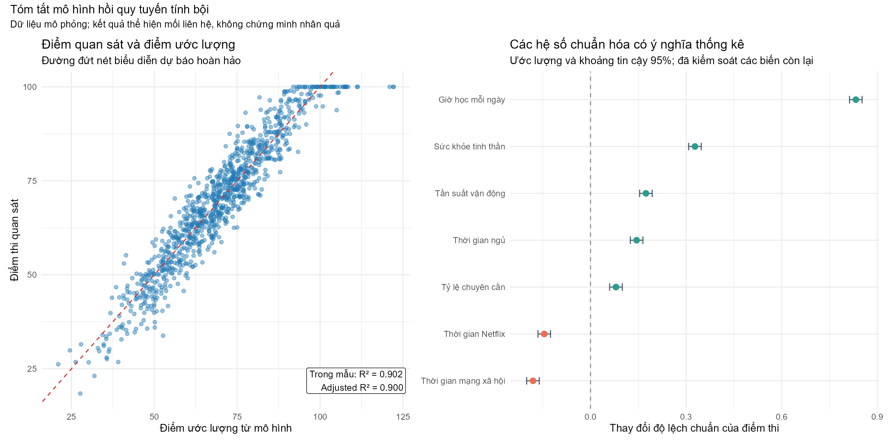

# Phân tích đa biến về kết quả học tập của sinh viên

*Multivariate Statistical Analysis of Student Performance in R*

Đồ án học thuật sử dụng R để làm sạch dữ liệu, kiểm tra giả định và phân tích
mối liên hệ giữa thói quen sinh hoạt, điều kiện học tập và kết quả thi của sinh
viên. Phần phân tích cá nhân tập trung vào MANOVA và hồi quy tuyến tính bội trên
1.000 hồ sơ mô phỏng.



## Kết quả chính

- Bộ dữ liệu được làm sạch từ 16 còn 15 biến sau khi loại mã định danh; không
  phát hiện dữ liệu khuyết.
- KMO bằng 0,17 nên PCA/EFA không được chọn làm phương pháp chính.
- One-way MANOVA cho thấy khác biệt tổng thể theo trình độ học vấn của phụ
  huynh (Wilks' Lambda = 0,977; p = 0,006), nhưng hiệu ứng nhỏ và khác biệt đơn
  biến chủ yếu nằm ở tỷ lệ chuyên cần.
- Trong mô hình two-way MANOVA, nhóm sức khỏe tinh thần và nhóm tần suất vận
  động có ý nghĩa thống kê; chưa có bằng chứng về tương tác giữa hai yếu tố
  (p = 0,302).
- Hồi quy tuyến tính bội đạt R² trong mẫu bằng 0,902 và Adjusted R² bằng 0,900.
  Giờ học, giấc ngủ, vận động, sức khỏe tinh thần và chuyên cần có hệ số dương;
  thời gian mạng xã hội và Netflix có hệ số âm.

Các kết quả trên phản ánh **mối liên hệ trong dữ liệu mô phỏng**, không chứng
minh quan hệ nhân quả và chưa phải đánh giá khả năng dự báo ngoài mẫu.

## Phương pháp và kỹ năng thể hiện

- Kiểm tra cấu trúc, missing values, ngoại lai và thống kê mô tả
- Bartlett test, KMO và đánh giá mức độ phù hợp của PCA/EFA
- One-way và two-way MANOVA, ANOVA hậu kiểm và Tukey HSD
- Hồi quy tuyến tính bội và diễn giải hệ số
- Kiểm tra VIF, phần dư, phương sai sai số và tính độc lập của sai số
- R Markdown, trực quan hóa với ggplot2 và báo cáo tái lập

## Vai trò cá nhân

Đây là đồ án nhóm gồm ba thành viên. **Lê Vũ Thành Đạt phụ trách chính Data 2**:
xử lý dữ liệu, thống kê mô tả, MANOVA và hồi quy tuyến tính. Ngoài ra, tôi tham
gia rà soát kết quả của cả ba phần và tổng hợp báo cáo cuối cùng. Chi tiết xem
tại [CONTRIBUTIONS.md](CONTRIBUTIONS.md).

## Cách chạy lại phần phân tích cá nhân

Yêu cầu: R 4.5 hoặc phiên bản tương thích và RStudio/Pandoc để tạo HTML.

```r
install.packages(c(
  "rmarkdown", "tidyverse", "rstatix", "car",
  "patchwork", "knitr", "kableExtra"
))

rmarkdown::render(
  "analysis/student_performance_analysis.Rmd",
  output_dir = "output/html",
  encoding = "UTF-8"
)
```

Tạo lại hình tóm tắt cho README:

```r
system("Rscript analysis/create_portfolio_figures.R")
```

## Cấu trúc thư mục

```text
.
├── analysis/
│   ├── student_performance_analysis.Rmd   # Phân tích Data 2
│   └── create_portfolio_figures.R         # Tạo hình tóm tắt
├── data/                                  # Dữ liệu dùng cho Data 2
├── group-code/                            # Mã nguồn của báo cáo nhóm
├── group-data/                            # Dữ liệu của các phần trong đồ án nhóm
├── output/
│   ├── figures/                           # Hình dùng trong portfolio
│   ├── html/                              # Báo cáo HTML có thể tái tạo
│   └── pdf/                               # Báo cáo public đã ẩn thông tin thành viên
├── CONTRIBUTIONS.md
└── DATA_SOURCES.md
```

## Báo cáo và mã nguồn

- [Phân tích Data 2 bằng R Markdown](analysis/student_performance_analysis.Rmd)
- [Báo cáo HTML đã chạy](output/html/student_performance_analysis.html)
- [Báo cáo nhóm — bản public](output/pdf/final-report-public.pdf)
- [Phụ lục — bản public](output/pdf/appendix-public.pdf)
- [Nguồn và điều kiện dữ liệu](DATA_SOURCES.md)

## Nguồn dữ liệu

Dữ liệu chính của phần Data 2 là
[Student Habits vs Academic Performance](https://www.kaggle.com/datasets/jayaantanaath/student-habits-vs-academic-performance)
do Jayanta Nath công bố theo giấy phép Apache 2.0. Bộ dữ liệu gồm 1.000 hồ sơ
mô phỏng và được dùng cho mục đích học tập. Nguồn của các phần còn lại được ghi
tại [DATA_SOURCES.md](DATA_SOURCES.md).

## Giới hạn

- Dữ liệu chính là dữ liệu mô phỏng, không phải mẫu đại diện cho sinh viên thực tế.
- Phân tích mang tính quan sát; không diễn giải các hệ số thành tác động nhân quả.
- R² được báo cáo trên dữ liệu huấn luyện, chưa qua train/test split hoặc
  cross-validation.
- `exam_score` bị chặn trên tại 100, vì vậy Tobit/censored regression là một
  hướng mở rộng hợp lý.
